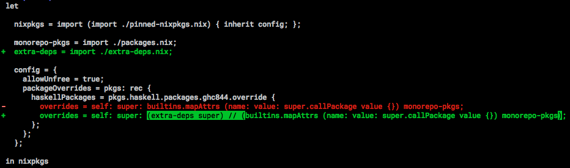

# Extra Deps

Nix provides us with a very extensive curated list of Haskell packages, but it
will often be the case that your project will depend on some package or package version that is not
available or that is marked as broken.

To implace the packages we want, we will use the same mechanism we used to add our monorepo packages.
The only difference is that the Nix expressions that we will use will reference remote source code.

Let's see an example. If we tried to use `http2-grpc-types` as a dependency to our packages the build would break:

```
nix-shell -p '(import ./release.nix).haskellPackages.ghcWithPackages (pkgs: [ pkgs.http2-grpc-types ])'
error: Package ‘http2-grpc-types-0.4.0.0’ in /nix/store/j9v72fi7jrkxgr3yib2xirmfsc440r5m-source/pkgs/development/haskell-modules/hackage-packages.nix:124744 is marked as broken, refusing to evaluate.

a) For `nixos-rebuild` you can set
  { nixpkgs.config.allowBroken = true; }
in configuration.nix to override this.

b) For `nix-env`, `nix-build`, `nix-shell` or any other Nix command you can add
  { allowBroken = true; }
to ~/.config/nixpkgs/config.nix.

(use '--show-trace' to show detailed location information)
```

The package is marked as broken. But if we know that `0.3.0.1` was ok we can simply reference the git commit.
To fix this we simply need to make use of the handy `cabal2nix` utility once again.

```bash
$ cabal2nix https://github.com/lucasdicioccio/http2-grpc-types --revision ea6cd15b9929494e0 2>/dev/null
{ mkDerivation, base, binary, bytestring, case-insensitive
, fetchgit, hpack, proto-lens, stdenv, zlib
}:
mkDerivation {
  pname = "http2-grpc-types";
  version = "0.3.0.1";
  src = fetchgit {
    url = "https://github.com/lucasdicioccio/http2-grpc-types";
    sha256 = "08ni3cl9q3va0sr81dahn17g9wf8fn6srp6nsnvpzrfrp3myfsym";
    rev = "ea6cd15b9929494e05e0ffb37aedccf915717020";
    fetchSubmodules = true;
  };
  libraryHaskellDepends = [
    base binary bytestring case-insensitive proto-lens zlib
  ];
  libraryToolDepends = [ hpack ];
  preConfigure = "hpack";
  homepage = "https://github.com/lucasdicioccio/http2-grpc-types#readme";
  description = "Types for gRPC over HTTP2 common for client and servers";
  license = stdenv.lib.licenses.bsd3;
}
```

Now all we have to do is replace the broken package `http2-grpc-types` with ours. To do so we create a file `extra-deps.nix` (we will use this file to hold all our overrides):

```nix
let

    http2-grpc-types = { mkDerivation, base, binary, bytestring, case-insensitive
        , fetchgit, hpack, proto-lens, stdenv, zlib
        }:
        mkDerivation {
          pname = "http2-grpc-types";
          version = "0.3.0.1";
          src = fetchgit {
            url = "https://github.com/lucasdicioccio/http2-grpc-types.git";
            sha256 = "08ni3cl9q3va0sr81dahn17g9wf8fn6srp6nsnvpzrfrp3myfsym";
            rev = "ea6cd15b9929494e05e0ffb37aedccf915717020";
            fetchSubmodules = true;
          };
          libraryHaskellDepends = [
            base binary bytestring case-insensitive proto-lens zlib
          ];
          libraryToolDepends = [ hpack ];
          preConfigure = "hpack";
          homepage = "https://github.com/lucasdicioccio/http2-grpc-types#readme";
          description = "Types for gRPC over HTTP2 common for client and servers";
          license = stdenv.lib.licenses.bsd3;
        };

in (super: {
    http2-grpc-types = super.callPackage http2-grpc-types {};
})
```

the above exported function is just the right transformation that we can apply with the `haskellPackages.override` function.

```nix
# release.nix
let

  nixpkgs = import (import ./pinned-nixpkgs.nix) { inherit config; };

  gitignore = nixpkgs.nix-gitignore.gitignoreSourcePure [ ../.gitignore ];
  extra-deps = import ./extra-deps.nix;

  config = {
    allowUnfree = true;
    packageOverrides = pkgs: rec {
      haskellPackages = pkgs.haskell.packages.ghc864.override {
        overrides = self: super: ((extra-deps super) // builtins.mapAttrs (name: path: super.callCabal2nix name (gitignore path) {}) (import ./packages.nix));
      };
    };
  };

in nixpkgs
```

```bash
diff -u monorepo-nix-expressions/monorepo/nix/release.nix extra-deps/monorepo/nix/release.nix | ydiff
```



```bash
$ nix-shell -p '(import ./release.nix).haskellPackages.ghcWithPackages (pkgs: [ pkgs.http2-grpc-types ])'
[nix-shell:.../nix]$ ghc-pkg list | grep http2-grpc-types
    http2-grpc-types-0.3.0.1
```

We can see that now we receive a prompt with the package just like we desired.

## Reassigning packages

Sometimes `nixpkgs` will contain multiple versions of the same package. This is the case for example in our snapshot with the `servant` packages.
Our haskell package set has a `servant_0_16_0_1` attribute. We can make this the default servant (as opposed to `servant-0.15` <sup>[1](#footnote-1)</sup>) by reassigning it in our transformation function:

```nix
let

    http2-grpc-types = { mkDerivation, base, binary, bytestring, case-insensitive
        , fetchgit, hpack, proto-lens, stdenv, zlib
        }:
        mkDerivation {
          pname = "http2-grpc-types";
          version = "0.3.0.1";
          src = fetchgit {
            url = "https://github.com/lucasdicioccio/http2-grpc-types.git";
            sha256 = "08ni3cl9q3va0sr81dahn17g9wf8fn6srp6nsnvpzrfrp3myfsym";
            rev = "ea6cd15b9929494e05e0ffb37aedccf915717020";
            fetchSubmodules = true;
          };
          libraryHaskellDepends = [
            base binary bytestring case-insensitive proto-lens zlib
          ];
          libraryToolDepends = [ hpack ];
          preConfigure = "hpack";
          homepage = "https://github.com/lucasdicioccio/http2-grpc-types#readme";
          description = "Types for gRPC over HTTP2 common for client and servers";
          license = stdenv.lib.licenses.bsd3;
        };

in (super: {
    http2-grpc-types = super.callPackage http2-grpc-types {};
    servant                  = super.servant_0_16_0_1;
    servant-server           = super.servant-server_0_16;
    servant-client           = super.servant-client_0_16;
    servant-client-core      = super.servant-client-core_0_16;
    servant-blaze            = super.servant-blaze_0_9;
})
```

```bash
nix-shell -p '(import ./release.nix).haskellPackages.ghcWithPackages (pkgs: [ pkgs.servant ])' --run "bash -c 'ghc-pkg list | grep servant'"
    servant-0.16.0.1
```

## Disabling tests

Sometimes a package will simply have tests that won't succeed because they require some setup
but you know the library code is OK. Then what you can do is simply disable the tests on that one package like so:

```
let

    dontCheck = (import ./release.nix).haskell.lib.dontCheck;

    ...

in (super: {
    system-fileio = dontCheck super.system-fileio;
    ...
})
```

In the [next chapter](../system-deps) we will se how to add system dependencies to our packages.

<a id="footnote-1"><b>[1]</b></a> `nix-instantiate --eval -E '(import (import ./pinned-nixpkgs.nix) {}).haskell.packages.ghc864.servant.version'` evaluates to `"0.15"`
