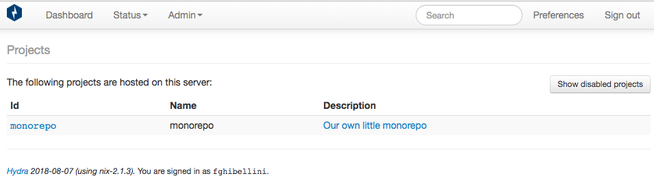
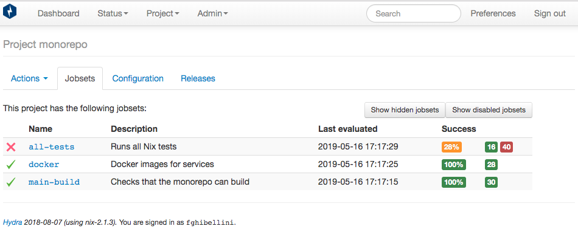
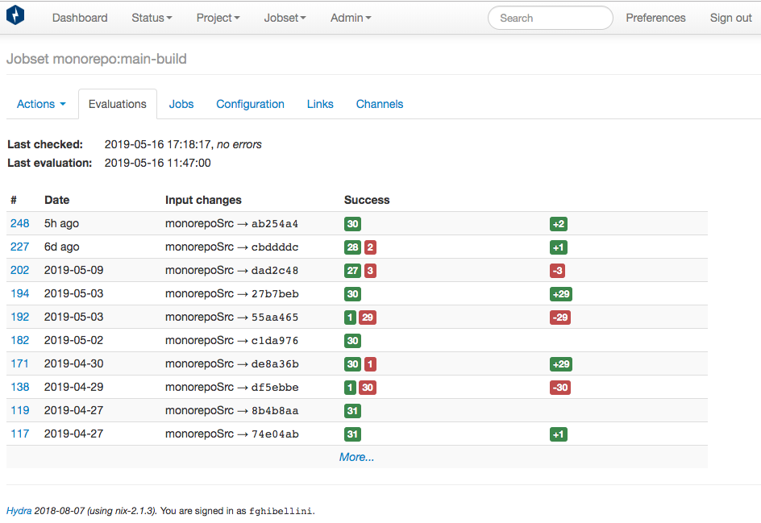
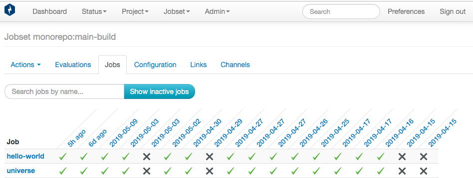
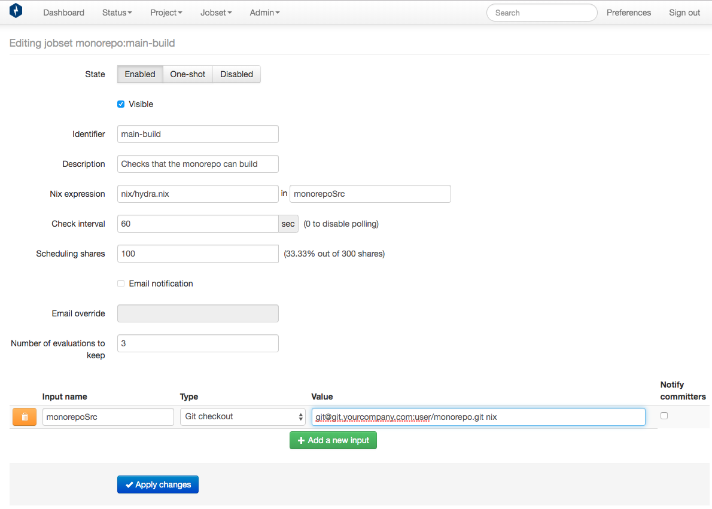

# Hydra Project Config

> POSSIBLE NIX IMPROVEMENT
>
> Ideally this whole chapter would not exist and the whole config could be specified as
> configuration of the Hydra service in the NixOS `configuration.nix` file.

## Initial Hydra setup

As root:

```
$ hydra-init # initialize DB
$ hydra-create-user alice --full-name 'Alice Q. User' \
    --email-address 'alice@example.org' --password foobar --role admin
```

## Structure

Hydra uses the following entities:

1. project
2. jobset
3. job

A job represents the execution of the build of a single derivation (and its dependencies).
Instead of configuring single jobs Hydra has a notion of jobsets. To configure a jobset you first need a Nix expression that evaluates
to a derivation-valued attribute set. The attribute names are used as job names.
Once you have this expression in your repo you can create a jobset by specifying the git url to track and the path to this Nix expression file.
Jobsets are configured inside of projects which are just logical groupings of them.

In practice you would have a structure similar to the following:

```
- monorepo [project]
   |
   +- main-build [jobset]
   |   |
   |   +- package1 [job]
   |   |
   |   +- package2 [job]
   |
   +- e2e-tests [jobset]
   |   |
   |   +- package1:test1 [job]
   |   |
   |   +- package2:test1 [job]
   |   |
   |   +- package1:special-test [job]
   |   |
   |   +- monorepo-test [job]
   |
   +- doc-validation [jobset]
       |
       +- dead-links [job]
       |
       +- user-handles-exist [job]
```

### Projects



### Jobsets



### Evaluations



### Jobs



### Adding a jobset



This is the `hydra.nix` file used in the above jobset definition:

```nix
# monorepo/nix/hydra.nix
let

    nixpkgs = import ./release.nix;
    monorepo-pkgs = import ./monorepo.nix;

    doHaddock = nixpkgs.haskell.lib.doHaddock;
    doCoverage = nixpkgs.haskell.lib.doCoverage;
    mapAttrs = nixpkgs.lib.mapAttrs;

in

    mapAttrs (name: value: doHaddock (doCoverage value)) monorepo-pkgs
```

## Evaluation mode

The evaluation of the jobset expression is run in pure-evaluation-mode.
From the Nix manual:

> Pure evaluation mode. This is a variant of the existing restricted evaluation mode. In pure mode, the Nix evaluator forbids access to anything that could cause different evaluations of the same command line arguments to produce a different result. This includes builtin functions such as builtins.getEnv, but more importantly, all filesystem or network access unless a content hash or commit hash is specified. For example, calls to builtins.fetchGit are only allowed if a rev attribute is specified.
>
> The goal of this feature is to enable true reproducibility and traceability of builds (including NixOS system configurations) at the evaluation level. For example, in the future, nixos-rebuild might build configurations from a Nix expression in a Git repository in pure mode. That expression might fetch other repositories such as Nixpkgs via builtins.fetchGit. The commit hash of the top-level repository then uniquely identifies a running system, and, in conjunction with that repository, allows it to be reproduced or modified.

For this reason evaluations that succeeded on your machine might fail on Hydra.
If the failure is cause by your expression trying to fetch some source-code repo, simply add it to the list of `allowed-uris` in the NixOS config file ([see](../setting-up-a-hydra-instance/)).


In the [next chapter](../nix-tests) we will write our first Nix tests.

