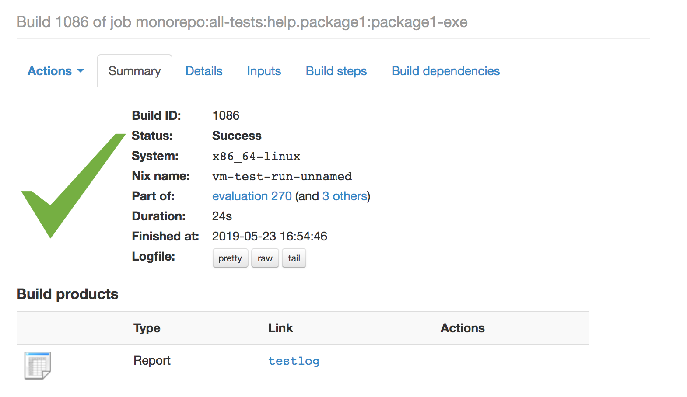
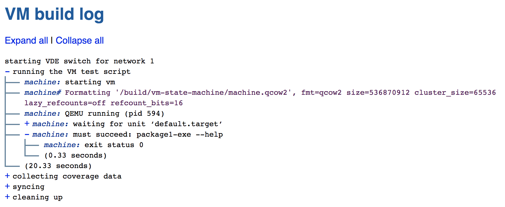

# Nix Tests

The following code asserts that `package1-exe` can be succesfully invoked with the `--help` flag.

```nix
# test-help-flag.nix
let
    nixpkgs = import ./release.nix;
    make-test = import "${import ./pinned-nixpkgs.nix}/nixos/tests/make-test.nix";

in
    make-test {

      nodes = { machine = { ... }: { environment.systemPackages = [ nixpkgs.haskellPackages.package1 ]; }; };

      testScript =
        ''
          $machine->start;
          $machine->waitForUnit("default.target");

	  # check that invoking the executable with the `--help` flag is supported
          $machine->succeed("package1-exe --help");
        '';

    }
```

You can run the test with:

```
nix-build ./test-help-flag.nix
```

This is what the above job would look like if executed on a Hydra instance:



clicking on "testlog" reveals an unfoldable report like the following:



## Rerunning a succesful test

Tests are just derivations and just like all derivations, once they are succesfully built
their result is stored in the Nix store and future evaluation will simply read
this value.

This in turn also means that once your test succeeds you will not be able to rerun it unless
you change something about the test.

It is though possible to run `nix --delete <path>` on the result of the path, which will remove
it from the store. This will allow you to run the test once again.
`nix --delete` will check that the supplied store path is not referenced by anyone, thus you will
first have to delete the `result` symlink that `nix-build` created.

[Next](../generating-tests) we will parameterize the test and run it for multiple executables.

